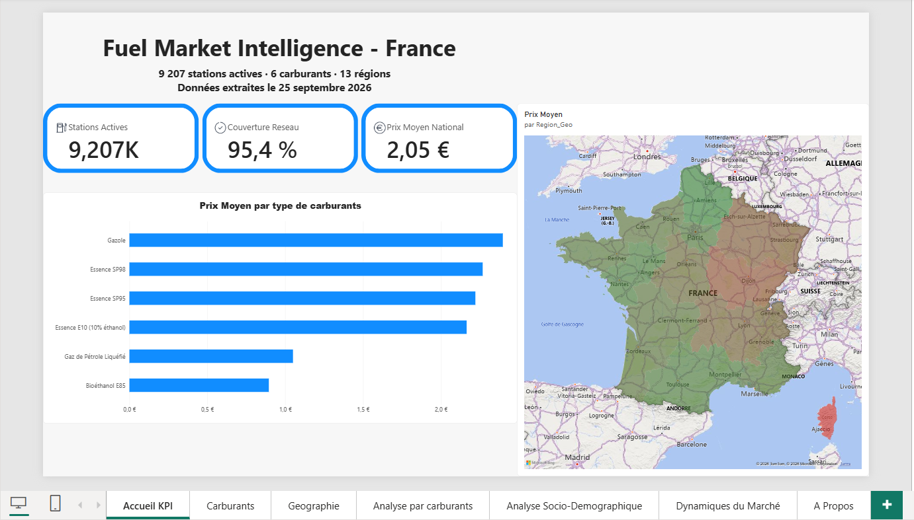
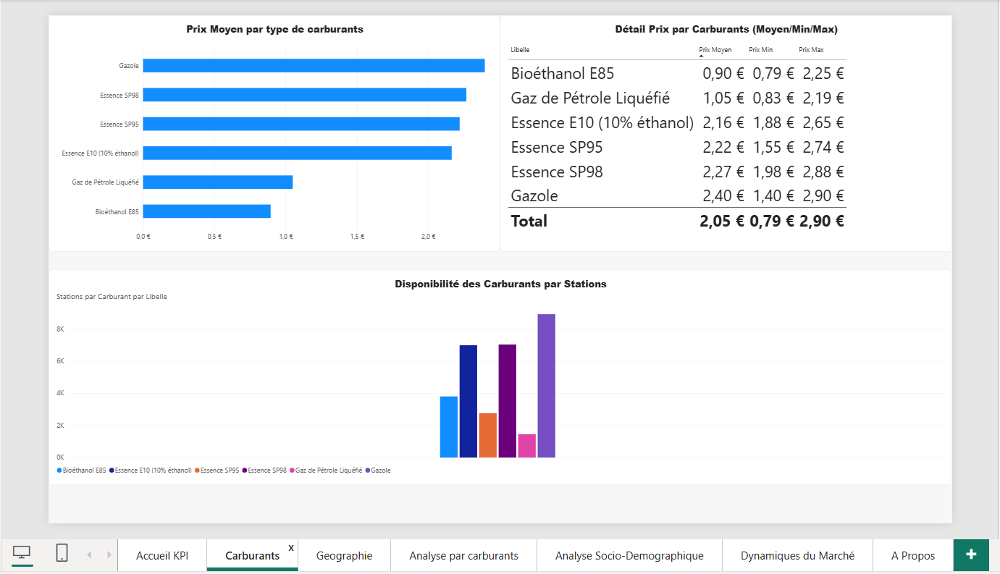
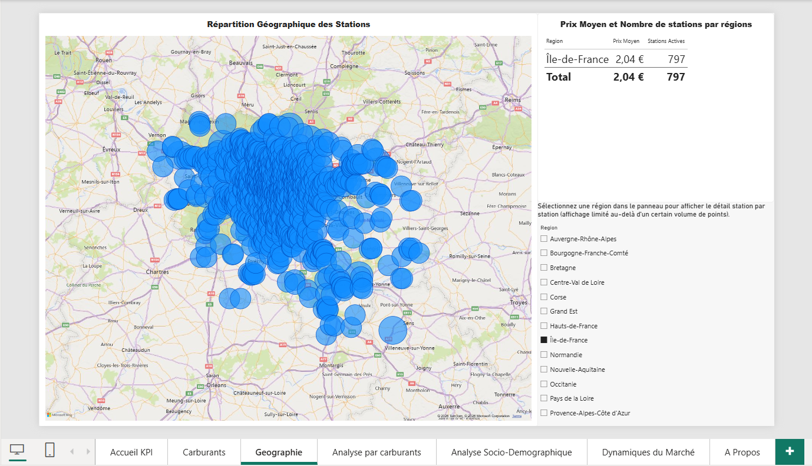
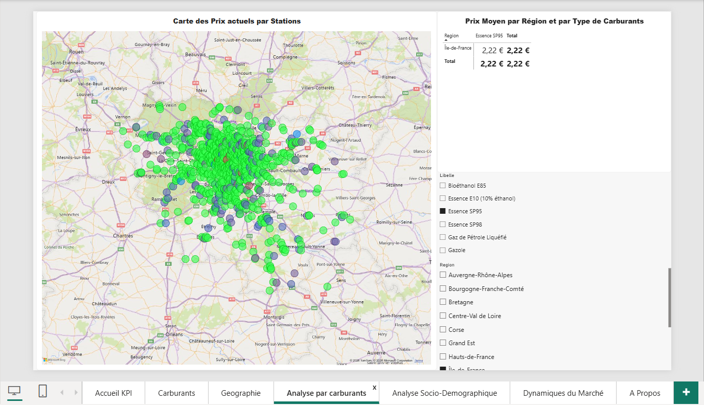
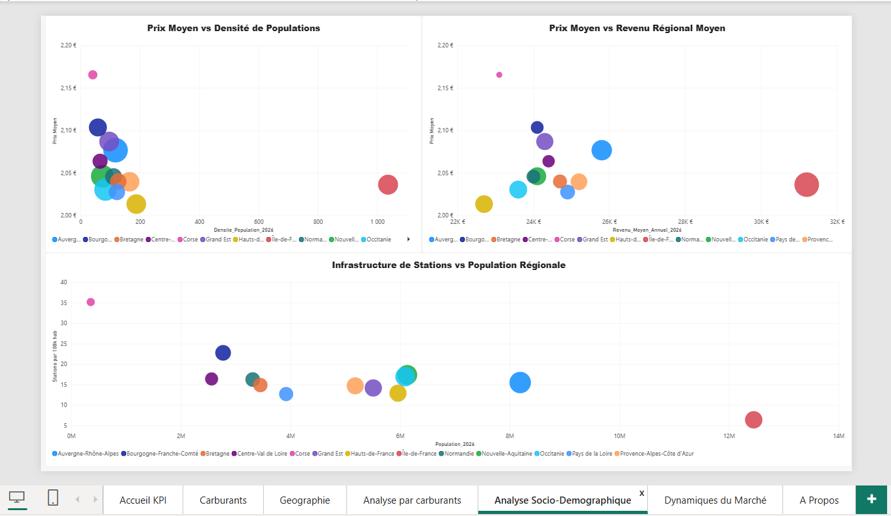
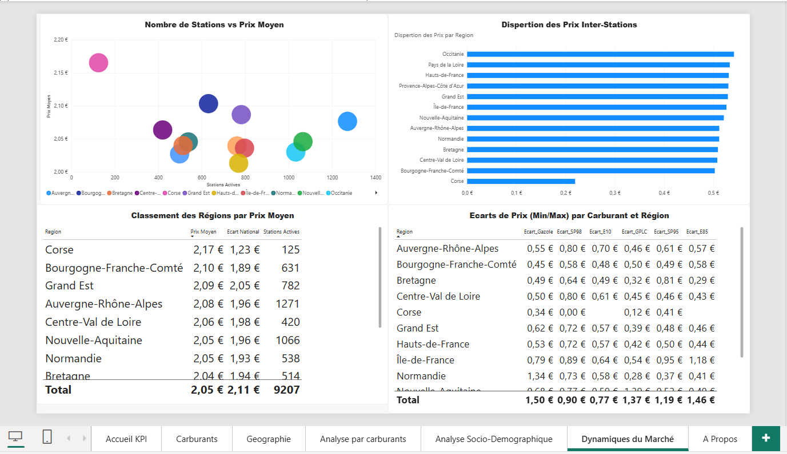
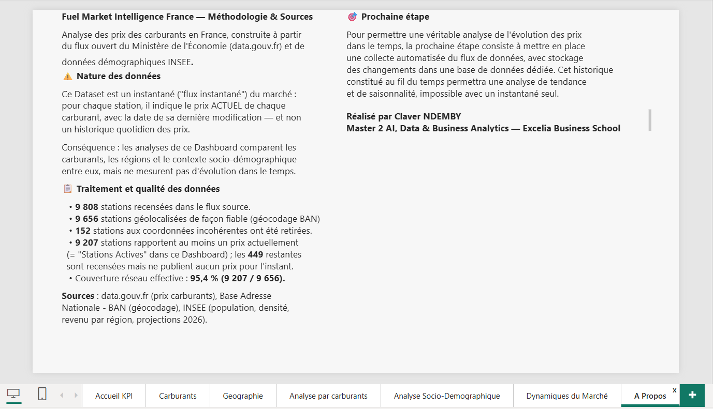

# ⛽ Fuel Market Intelligence France

Dashboard Power BI d'analyse des prix des carburants en France : couverture nationale, comparaison inter-carburants, dynamiques régionales et corrélations socio-démographiques.

---

## 📊 Vue d'ensemble

Le carburant fait l'actualité pour de mauvaises raisons — prix qui flirtent avec les 3 €/litre, disparités régionales, fermetures de stations. Ce projet part d'une question simple : **que disent réellement les chiffres**, au-delà des impressions ?

Le dashboard analyse **9 808 stations-service** recensées en France métropolitaine, à travers **6 types de carburants** et **13 régions**, en croisant les prix avec des données démographiques (densité de population, revenu moyen) pour identifier ce qui influence réellement les prix — et ce qui, contrairement à l'intuition, n'a aucun effet.

## 🔍 Insights clés

- **La densité de population n'explique pas les prix.** L'Île-de-France, région la plus dense de France, affiche l'un des prix moyens les plus bas — la concurrence entre stations urbaines tire les prix vers le bas.
- **Le revenu régional non plus.** Aucune corrélation claire entre richesse d'une région et prix à la pompe : le marché du carburant se fixe à l'échelle nationale/internationale (cours du pétrole, taxes), pas localement.
- **La dispersion des prix varie fortement selon les régions.** La Corse (marché insulaire, peu de concurrence directe) affiche des prix très homogènes ; l'Occitanie ou les Hauts-de-France, beaucoup plus hétérogènes.
- **Le Gazole reste le carburant le plus cher en moyenne**, le Bioéthanol E85 le moins cher — un écart qui éclaire en partie l'essor des véhicules flex-fuel.

## 📄 Structure du dashboard (7 pages)

### Accueil KPI
Vue d'ensemble : stations actives, couverture réseau, prix moyen, carte régionale, comparatif carburants.

### Carburants
Prix moyen/min/max par carburant, disponibilité par station.

### Géographie
Carte interactive des stations, filtrable par région.

### Analyse par Carburants
Carte de prix par région + matrice croisée région × carburant.

### Analyse Socio-Démographique
Corrélations prix vs densité de population, revenu régional, infrastructure.

### Dynamiques du Marché
Effet de la concurrence sur les prix, dispersion inter-stations, classement régional.

### À Propos
Méthodologie, sources, limites des données, feuille de route.

## 🛠️ Construction technique

**Modélisation** — schéma en étoile : `Fact_Prix` reliée à `Dim_Station`, `Dim_Carburant`, `Dim_Date` et une table `INSEE` (densité, revenu, population par région).

**ETL** — Python (pandas) pour :
- parser le flux JSON/CSV source et le restructurer en format long (1 ligne = 1 station × 1 carburant)
- géocoder les ~9 800 stations via l'API Base Adresse Nationale (BAN), les coordonnées brutes du flux étant en projection Lambert93 corrompue
- détecter et corriger les anomalies géographiques (stations positionnées par erreur en outre-mer suite à des homonymies d'adresse)
- détecter et exclure les prix aberrants (écarts de plus du double à la médiane du carburant concerné)

**DAX** — 20+ mesures : prix moyens par carburant/région, écarts et dispersion inter-stations, ratios socio-démographiques (stations pour 100k habitants, prix rapporté au revenu), mise en forme conditionnelle par règles.

## ⚠️ Méthodologie & limites des données

Le jeu de données source (flux "instantané" de data.gouv.fr) est un **instantané du marché** : pour chaque station, il indique le prix *actuel* de chaque carburant avec sa date de dernière modification — **et non un historique quotidien des prix**.

Conséquence assumée dans la conception du dashboard : les analyses comparent les carburants, les régions et le contexte socio-démographique entre eux, mais ne mesurent pas d'évolution temporelle. Un graphique de tendance construit sur ces dates aurait été trompeur (voir détail sur la page "À Propos" du dashboard).

**Qualité des données** :
- 9 808 stations recensées → 9 656 géolocalisées de façon fiable (152 aux coordonnées incohérentes ont été retirées)
- 9 207 stations rapportent au moins un prix actuellement (couverture réseau : 95,4 %)
- 6 prix manifestement erronés identifiés et exclus (écarts de plus du double à la médiane du carburant concerné)

**Prochaine étape** : mise en place d'une collecte automatisée (script Python + stockage en base de données) pour constituer un véritable historique et permettre, cette fois, une analyse d'évolution des prix dans le temps.

## 📁 Sources des données

- [data.gouv.fr](https://data.economie.gouv.fr/explore/dataset/prix-des-carburants-en-france-flux-instantane-v2/) — Prix des carburants, Ministère de l'Économie
- [Base Adresse Nationale (BAN)](https://api-adresse.data.gouv.fr/) — Géocodage
- INSEE — Population, densité et revenu par région (projections 2026)

## 👤 Auteur

**Claver NDEMBY**
Master 2 AI, Data & Business Analytics — Excelia Business School

---

📊 Fichiers de données dans [`/data`](./data) : tables `Fact_Prix`, `Dim_Station`, `Dim_Carburant`, `Dim_Date`, et données INSEE par région
📁 Fichier Power BI complet : [`Fuel_Intelligence_FINAL.pbix`](./Fuel_Intelligence_FINAL.pbix)
